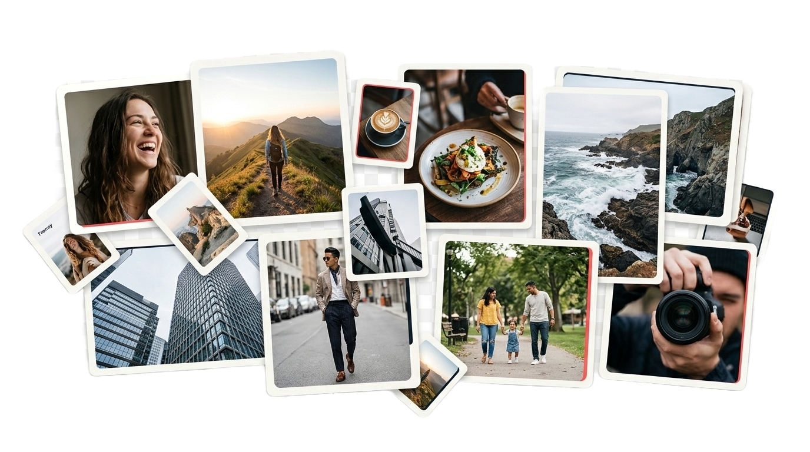

# Framey

**Capture the moments that matter.**

A full-stack, Instagram-style social app: share photos and short videos, edit them right in the browser, and follow the people whose moments you care about.

[**Live demo →**](https://framey-lac.vercel.app/)

## Features

- **In-browser media editor.** Crop, set the aspect ratio, pan and zoom, then apply filters and adjustments. Videos can be trimmed, muted, and given a cover frame with ffmpeg.wasm. All of this happens before anything is uploaded.
- **Multi-media posts.** A single carousel can mix images and video. Each item has its own ratio, alt text, and people tags. Posts also support captions, locations, and collaborators.
- **Feed, reels and stories.** Stories can be saved as highlights and shared with a close-friends list.
- **Social graph.** Follow people, set your account to public or private, handle follow requests, and block users.
- **Engagement.** Likes, threaded comments, saved collections, sharing, and GIFs via Giphy.
- **Real-time direct messages and notifications** over Pusher.
- **Search, profiles, archive and activity history.**
- **Auth.** Sign in with email and password or with Google (NextAuth v5), with a "Remember me" option, rate-limited logins, and a guided onboarding step.
- **i18n.** Language preference is stored in a cookie. Dark mode is the default.

## Tech stack

| Layer | Tools |
| --- | --- |
| Framework | Next.js 16 (App Router), React 19, React Compiler |
| UI | Tailwind CSS v4, shadcn/ui, Base UI, Embla Carousel |
| State and forms | Redux Toolkit, React Hook Form, Zod |
| Data | Drizzle ORM, Neon serverless Postgres |
| Auth | NextAuth v5 (Credentials + Google), Drizzle adapter |
| Media | Canvas, ffmpeg.wasm, UploadThing, sharp |
| Real-time | Pusher |
| Rate limiting | Upstash Redis |

## Author

**Khaled Medhat**: [GitHub](https://github.com/KhaledMedhat)
